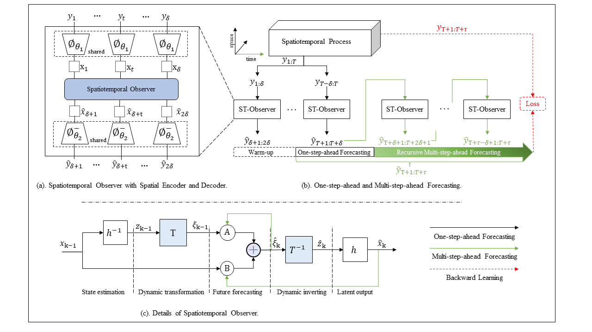

# Spatiotemporal Observer
  

This repository contains the implementation code for paper:

> **Spatiotemporal Observer Design for Predictive Leading of High-Dimensional Data**\
> [Tongyi Liang](https://github.com/leonty1.html), [Han-Xiong Li](https://scholar.google.com/citations?user=tnnePQwAAAAJ.html).\
> Preprint: https://arxiv.org/abs/2402.15284 \
> Under Review by IEEE, 2024. 

## Graph Abstract

<p align="center">
     <br>
</p>


## Table of Contents
Our code is developed based on [SimVP](https://github.com/A4Bio/SimVP). Code structure is organized as:

* `API/` : dataloaders and metrics.
* `data/` : data repository.
* `main.py` : arguments of hyperparameters.
* `model.py` ST Observer model.
* `module.py` key modules.
* `exp.py` experiments with training, validating, and testing pipelines.

### Dataset

Moving MNIST dataset shall be downloiaded directly by './API/download_mmnist.sh'

TaxiBJ dataset can be dowlnloaded by [Dropbox](https://www.dropbox.com/sh/l9drnyeftcmy3j1/AACCgUyOj2akPNBwFAe9W1-ia?dl=0) provided by [SimVP](https://github.com/A4Bio/SimVP). 
After downloading, please put it into folder `./data/taxibj'.

CIKM is dowloaded from [TianChi](https://tianchi.aliyun.com/competition/entrance%20/231596/information).

## Citation

If you are interested in our repository and our paper, please cite the following paper:

```
@article{liang2024spatiotemporal,
  title={Spatiotemporal Observer Design for Predictive Learning of High-Dimensional Data},
  author={Liang, Tongyi and Li, Han-Xiong},
  journal={arXiv preprint arXiv:2402.15284},
  year={2024}
}
```

## Contact
Pre-trained models available upon email request.
If you need, please contact us through email (t.y.liang@my.cityu.edu.hk, mehxli@cityu.edu.hk).


